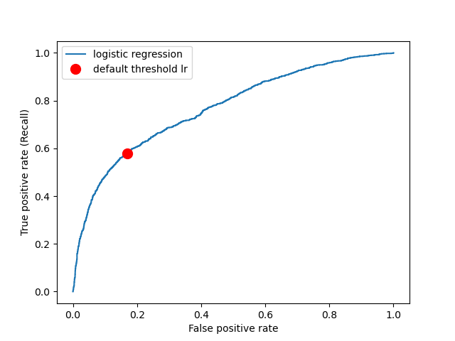

# Results

## Model Results
We evaluated the model from pickle on the test dataset and we obtained comparable test scores to the validation score. We plotted the Confusion Matrix and the ROC-AUC curve corresponding to the model on the predicted labels.

## Reservations and Suggestions
Major limitation of this project is that the data was collected in 2005. Consumers’ spending behaviours and tastes must have changed since then so the results of this project should not be taken for granted and be blindly applied to the current setting. To further improve this model in the future, we suggest including more features such as income, vocation, size of the household, and debt to asset ratio. With more relevant features to base the predictions on, we should be able to predict our target class with more accuracy.
## References
Dua, D., & Graff, C. (2017). UCI Machine Learning Repository. Opgehaal van http://archive.ics.uci.edu/ml

Python Core Team. (2019). Python: A dynamic, open source programming language. Opgehaal van Python Software Foundation website: https://www.python.org/

Hunter, J. D. (2007). Matplotlib: A 2D graphics environment. Computing in science & engineering, 9(3), 90.

Pedregosa, F., Varoquaux, G., Gramfort, A., Michel, V., Thirion, B., Grisel, O., … Duchesnay, E. (2011). Scikit-learn: Machine Learning in Python. Journal of Machine Learning Research, 12, 2825–2830.

McKinney, W. (2010). Data Structures for Statistical Computing in Python. In S. van der Walt & J. Millman (Reds), Proceedings of the 9th Python in Science Conference (bll 51–56).

Harris, C. R., Millman, K. J., van der Walt, S. J., Gommers, R., Virtanen, P., Cournapeau, D., … Oliphant, T. E. (2020). Array programming with NumPy. Nature, 585(7825), 357–362. doi:10.1038/s41586-020-2649-2